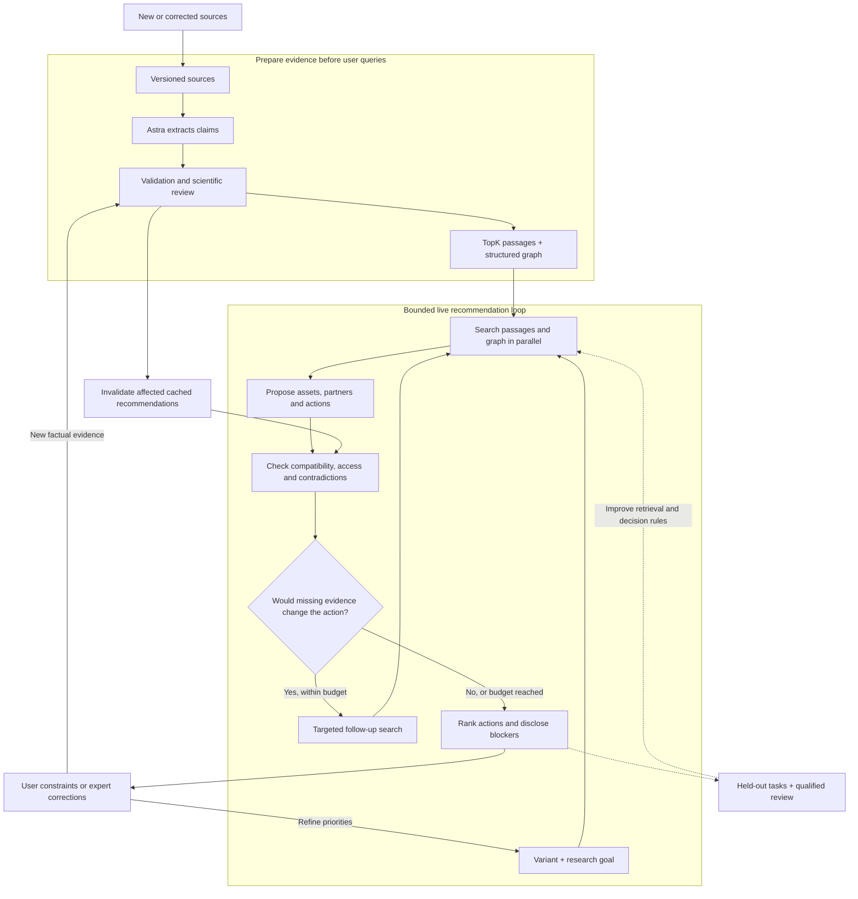
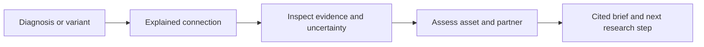

# LIT rare-disease knowledge graph

> **Runnable graph skeleton:** See [ATLAS.md](ATLAS.md) for the local explorer, schema, ingestion boundary, commands, tests and research-backed architecture. The bundled demo is explicitly synthetic.


Research and extraction planning for the **AI Atlas for the World’s Rare Diseases** challenge.

The original six-page PDF is [`Knowledge graph`](Knowledge%20graph) (its filename has no extension). Its text is preserved in [`data/source/challenge-brief.txt`](data/source/challenge-brief.txt).

## Architecture and visual walkthroughs

The challenge asks for a journey from diagnosis to a justified connection, reusable asset, partner and practical next step. This architecture supports that journey by checking whether a proposed action is scientifically relevant and feasible, with its evidence and unresolved questions visible.



- **[Explore all five loops and compare approaches](docs/visualizations/research-decision-loops.html):** switch between evidence preparation, recommendation, feedback, maintenance and evaluation; test how missing or incompatible evidence changes an action.
- **[Explore the interface concept](docs/visualizations/rare-atlas-interface.html):** follow a fictional diagnosis through connections, evidence, assets and a collaboration brief. This explains the intended experience, not live scientific findings.

The interactive files can be downloaded and opened in a browser; GitHub displays their source. The diagrams here render directly in the README.



**Why this direction:** TopK finds relevant evidence; the graph preserves relationships and provenance; Astra assesses candidate actions; validation and review keep unsupported connections from becoming recommendations. Precomputed evidence, parallel retrieval and a limited follow-up round keep live work bounded. These techniques are not individually new—the value to test is how well the complete workflow reduces effort to an acceptable research proposal. **10× is a target, not a measured result**, and these loops remain proposed rather than fully implemented.

## Deliverables

- [PDF review and complete source inventory](docs/pdf-review.md)
- [Source-by-source extraction guide](docs/source-extraction-guide.md)
- [Additional sources and ingestion priorities](docs/additional-sources.md)
- [Graph design and implementation sequence](docs/ingestion-plan.md)
- [GRIN cluster, demo and evaluation plan](docs/grin-cluster-plan.md)
- [Frontend strategy](docs/frontend-strategy.md)
- [Proposed recommendation loops and model architecture](docs/architecture/recommendation-loops.md)

This repository documents how to acquire and model the sources. The runnable skeleton includes a synthetic acceptance graph and an offline HPOA converter; it does not yet contain a populated biomedical graph or production ingestion connectors. Access and reuse conditions vary by provider; evidence and unresolved dependencies are recorded per source.

## Reproduce the PDF extraction

Requires Poppler (`pdfinfo`, `pdftotext`). Run from the repository root:

```bash
pdfinfo 'Knowledge graph'
pdftotext -layout 'Knowledge graph' data/source/challenge-brief.txt
sha256sum 'Knowledge graph'
```

Expected SHA-256: `9c502bdfcc0d5c400c11dd7a78bd9fc3c4b4f07529a973e076d109e28605d67e`.

The page boundaries in the extracted text are form-feed characters. Source inventory page numbers refer to the PDF's physical pages, numbered 1–6.

## Maintain the research guide

The guide covers **21 PDF sources/categories**; the expansion plan recommends **16 additional sources**. Edit source notes under `docs/research/`, then rebuild the consolidated Markdown file:

```bash
python3 scripts/build_source_guide.py
python3 scripts/build_source_guide.py --check
```

The check verifies the PDF checksum, source inventory, all 18 embedded PDF URLs, section citations, and generated-file freshness. It does not test production connectors or certify scientific claims. Small read-only API/file probes are recorded under `docs/research/*-probes.json`; access failures and unresolved rights are documented in the guide. See the [research completion audit](docs/research-audit.md) for verification scope.
