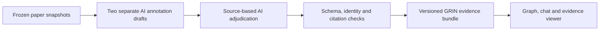

# Atlas — evidence for rare-disease research

Atlas helps researchers and patient organizations explore how rare diseases, gene variants, published evidence, and research resources connect. The aim is to make a research question easier to investigate: **what is known, which source supports it, what might be reusable, and what still needs checking?**

Our first working case focuses on **GRIN2A- and GRIN2B-related neurodevelopmental disorders**, with particular attention to variants with published evidence of reduced NMDA-receptor function. The demo includes uncertain and opposing cases so that users can inspect the limits of that grouping.

Ask Atlas stays focused on this one cluster. The top search explores the wider published graph without changing the answer scope. For a disease outside the demo cluster, a matching graph record is enough to acknowledge: **“We have recorded this disease in the knowledge graph.”** This is a record-presence statement only; it does not imply that Atlas has reviewed its disease mechanisms, validated its relationships, or can recommend research actions for it. Only acknowledge a record when a lookup actually finds it; otherwise report a coverage gap. Detailed evidence answers and recommendations remain focused on GRIN2A/GRIN2B. See the [demo scope contract](docs/demo-answer-scope.md).

**[Open Atlas](https://atlas.varentik.com/explore) · [Explore the GRIN evidence](https://atlas.varentik.com/cluster) · [Propose an addition](https://atlas.varentik.com/propose)**

This is a research prototype. Its evidence has been audited by AI annotators; human expert review is pending. It does not determine diagnosis, treatment, or patient eligibility.

## Try it

Open **Ask Atlas** in the graph. The demo question is already filled in—press **Send**, or edit it first:

> Why is GRIN2B p.Ser541Arg core while p.Cys461Phe is provisional? Compare the WT measurements and conflicting evidence.

The answer links to source-reported classifications, selected measurements, and the underlying records. In the evidence viewer, compare the variant with its **wild-type (WT)** reference and inspect the original experimental conditions.

To try the missing-information flow, search for an item absent from the graph. **Propose an addition** opens a form with the search already filled in. Submit an item name, description, and optional source link; the suggestion is saved privately as **pending review**, with a receipt that survives page reloads. It does not become a verified graph claim automatically.

## What exists today

These are three different data layers. Their counts should not be added together or treated as counts of independent scientific findings.

| Layer | Current scope | Where it is used |
| --- | --- | --- |
| Source archive | **21,746,825 normalized records** across **40 collections** in the recorded harvest snapshot | Local files, with versioned manifests and coverage reports |
| TopK search pilot | **15,502 searchable documents**, including curated evidence cards and passages from **355 licensed full-text articles** | Separate literature-search service; the full harvest has not been indexed |
| Reviewed GRIN demo | **10 selected variants**, **7 papers**, **340 observations**, **53 annotation claims**, and **11 unresolved issues** | Live graph/chat and evidence viewer on Cloudflare |

The displayed graph contains **35 entities and 44 graph claims**. Those graph relationships are a different representation from the 53 source-annotation claims in the evidence viewer. The full harvest has not been converted into a reviewed graph.

The harvest includes metadata, annotations, associations, and query memberships. Some providers require permission, some full texts remain unavailable, and “complete” refers to each manifest's declared scope. See the [coverage report](docs/harvest-coverage.md) for the exact boundaries.

## The decisions behind the system

### Keep retrieval, evidence, and decisions separate

**TopK finds relevant passages.** It supports keyword, semantic, and hybrid search. Existing curated evidence cards link back to specific graph claims. A passage appearing near the top of search does not establish a biological relationship, and an uncurated search hit cannot create an edge.

**The graph stores explicit relationships and their evidence.** Each claim needs identifiable entities, a source, context, and a review state. Source snapshots remain the evidence archive; TopK is a searchable copy. A hash check prevents the search pilot from linking evidence IDs to the wrong graph revision.

Structured databases already provide identifiers and explicit associations that can be mapped with their provenance. Papers require a separate extraction and review step; we do not need a language model to reinterpret every structured row.

**Decision models belong inside a checked workflow.** We plan to compare Sol extraction, Astra extraction, and Sol extraction with Astra review under declared budgets. These are evaluation candidates; a production extraction runner and an autonomous recommendation loop are not implemented. The hosted **Ask Atlas currently uses deterministic graph and annotation lookup**, with no live LLM generation or TopK retrieval in that chat.

The expanded seven-paper annotations have also **not yet replaced the earlier curated bundle in TopK**. Keeping those versions explicit prevents the search pilot and the hosted demo from appearing more synchronized than they are.

### Build relationships from observations that can be inspected

An **entity** is something such as a gene, protein variant, paper, or research resource. An **observation** records what a source reports in a particular experiment. A **claim** expresses an interpretation or relationship supported by observations and source passages.

For example, a variant's current-density measurement and its WT comparator are observations. A paper's overall “Likely loss of function” classification is a separate claim. We preserve both instead of treating one low measurement as an overall functional conclusion.

For the current GRIN work, the preparation process is:



The annotation format retains raw reported values, units, uncertainty, bounds, sample counts, WT comparisons, and assay conditions. Direct measurements, author-calculated predictions, drug responses, and secondary summaries remain distinguishable. Reused experiments and contradictory source values remain visible.

### Start with a defensible small cluster

The current grouping follows published functional classifications and explicit inclusion rules. It is **not an unsupervised clustering result**.

| Group | Selected variants |
| --- | --- |
| Core: likely reduced function | GRIN2A G483R, A716T, D731N; GRIN2B E413G, S541R, P553T |
| Provisional: possible reduced function | GRIN2B C461F |
| Opposing-function controls | GRIN2B S541G, A639V |
| Unresolved control | GRIN2B R540H |

Core inclusion requires a primary-source **Likely LoF** classification and an eligible quantitative intrinsic-function measurement with a WT comparator. Pathogenicity alone is insufficient. Possible LoF stays provisional, and unresolved evidence is not forced into a positive or negative group.

Protein notation is not a fully resolved genomic allele: transcript and construct conflicts still need reconciliation. Likewise, the graph's visual positions are a layout choice, not a measure of biological similarity. See the [cluster report](docs/grin-cluster-evidence.md) for the complete rules and limitations.

### Let users identify gaps without changing the evidence silently

Empty searches and explicit chat coverage gaps offer **Propose an addition**. Suggestions go to a private Cloudflare SQLite-backed Durable Object inbox, separate from the evidence graph and TopK. Retries are idempotent, and the public API exposes only minimal receipt status—not a list of submissions or their contents.

Account administrators can inspect the inbox in Cloudflare. A dedicated reviewer interface and an approval-to-graph workflow remain future work. The [proposal guide](docs/proposal-inbox.md) explains storage, review access, and local testing.

## How we check quality

The seven development papers were annotated by **two fresh-context AI agents** using identical frozen sources. A third AI agent checked both agreements and disagreements against those sources. Source hashes, exact citation spans, table coverage, and reproducible bundle builds are recorded in the [annotation receipt](data/benchmarks/grin-v1/cluster-annotation-receipt-v2.json).

That gives us an auditable development reference. It does **not** make the reviewers independent human experts: shared model errors remain possible, and these exposed papers cannot serve as a held-out test set.

The benchmark machinery already validates inputs and scores observation precision/recall, field agreement, evidence grounding, decision labels, and abstentions. Its runnable synthetic example tests the machinery. **No held-out extraction-model accuracy has been measured.** The newer interval-aware annotation format also requires an explicit scorer extension; the earlier scalar scorer cannot evaluate it in full.

The next evaluation loop is to:

1. Screen new papers and group overlapping studies to prevent leakage.
2. Prepare complete source packets and independently reviewed reference annotations.
3. Freeze the held-out set, extraction contract, scoring rules, and model budgets.
4. Run comparable models and retrieval baselines; retain failures and abstentions.
5. Score accuracy, citation grounding, reviewer correction effort, latency, and cost. Improve on development data before testing again.

TopK already has a small **known-case retrieval regression** over ten curated variants. Its retrieval scores are separate from extraction accuracy or scientific validation. Neither a “10×” improvement nor a scientifically validated automated clustering method has been demonstrated. See the [benchmark protocol](docs/grin-benchmark.md) and [search report](docs/topk-search.md).

## Run it locally

Run commands from the repository root. There are separate entry points because they use different data and services.

### Fresh checkout: explore the software with fictional data

The Python core requires **Python 3.11+** and no third-party runtime dependencies:

```bash
python3 -m atlas demo --db data/local-demo.sqlite
python3 -m atlas serve --db data/local-demo.sqlite --port 8765
```

Open [localhost:8765](http://127.0.0.1:8765). This creates an explicitly **synthetic** dataset; it does not reproduce the real hosted GRIN annotations. Creation refuses to overwrite an existing database. The legacy local server is read-only and cannot save proposals.

### Full hosted application, including proposal storage

This requires Node.js, `uv`, Python 3.13+ for the Cloudflare runtime, and the matching local frozen GRIN source snapshot at `data/processed/benchmarks/grin-development-v1/sources.json`. That source file is excluded from Git, so a fresh clone alone cannot rebuild the complete hosted evidence view.

```bash
python3 scripts/build_cloudflare.py
cd deploy/cloudflare
uv run pywrangler dev --port 8788
```

Open [localhost:8788/explore](http://localhost:8788/explore). The build checks the annotation receipt and source hashes, packages the real GRIN data, and refuses a synthetic production bundle. Local proposal storage is separate from production.

For an existing deployment, upload a version and then direct traffic to it:

```bash
uv run pywrangler versions upload --message "Describe the update"
uv run pywrangler versions deploy <returned-version-id>@100% --yes
```

The existing storage migration was applied with `pywrangler deploy`; future storage migrations also need that deployment path. Current release provenance is in [release.json](deploy/cloudflare/release.json). The hosted build publishes reviewed metadata and bounded source excerpts, not the full harvested corpus or local secrets.

For the standalone annotation viewer, see the [cluster setup](docs/grin-cluster-evidence.md#rebuild-and-run). For TopK, install `.[search]`, keep `TOPK_API_KEY` in the ignored `.env`, and follow the [search setup](docs/topk-search.md#local-setup). Never put credentials into browser code or Git.

### Checks

```bash
python3 -m unittest discover -s tests
python3 -m unittest discover -s tests_benchmark
python3 -m unittest discover -s tests_search
python3 -m unittest discover -s tests_harvest
python3 scripts/build_source_guide.py --check
```

These verify software behavior and documented provenance. Live TopK verification, frozen-source rebuilds, and expert scientific review have additional requirements described in their guides.

## Find your way around

| Start here | What it contains |
| --- | --- |
| [Source inventory](docs/pdf-review.md) and [extraction guide](docs/source-extraction-guide.md) | Sources from the original challenge and acquisition methods |
| [Harvest coverage](docs/harvest-coverage.md) | Acquired scope, counts, access restrictions, and gaps |
| [GRIN evidence cluster](docs/grin-cluster-evidence.md) | Current seven-paper reference, annotation process, and rebuild commands |
| [TopK search](docs/topk-search.md) | Index scope, retrieval behavior, setup, and verification |
| [Benchmark](docs/grin-benchmark.md) and [annotation contract](docs/grin-cluster-annotation-contract.md) | Scoring foundation and the richer source-annotation format |
| [Proposal inbox](docs/proposal-inbox.md) | Missing-item submissions and private review storage |
| [Core developer guide](ATLAS.md) | Graph schema, CLI, local fixtures, and ingestion boundary |
| [Recommendation-loop design](docs/architecture/recommendation-loops.md) | Planning snapshot for later model-assisted research recommendations |

Code lives in `harvest/` (acquisition), `atlas/` (graph, search, annotation, benchmark, and UI), and `deploy/cloudflare/` (hosted runtime). Small curated artifacts and receipts are committed under `data/curated/` and `data/benchmarks/`. Large raw files, processed source snapshots, and secrets stay outside Git.

The original six-page challenge PDF is [Knowledge graph](Knowledge%20graph); its filename has no extension. Its extracted text is [challenge-brief.txt](data/source/challenge-brief.txt). The [source guide](docs/source-extraction-guide.md) and [research audit](docs/research-audit.md) preserve the original source inventory and reproducibility checks.
