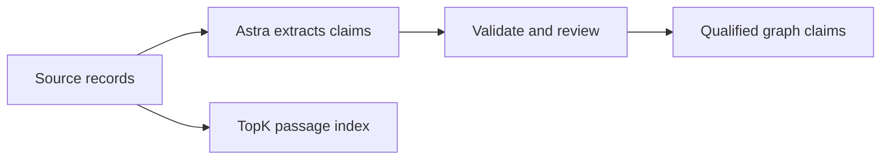
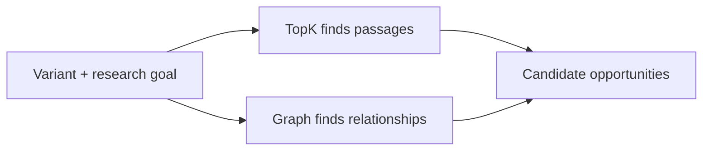
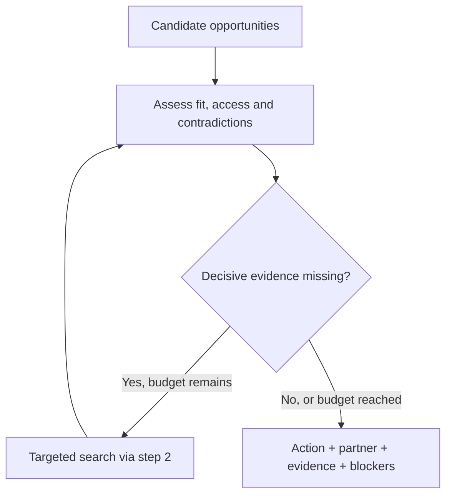
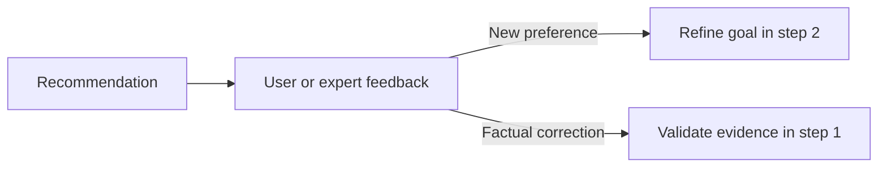
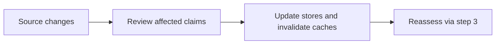
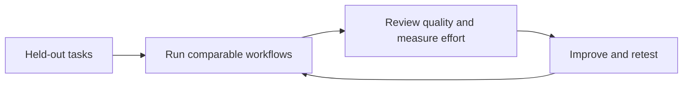

# LIT rare-disease knowledge graph

> **Runnable graph skeleton:** See [ATLAS.md](ATLAS.md) for the local explorer, schema, ingestion boundary, commands, tests and research-backed architecture. The bundled demo is explicitly synthetic.


Research and extraction planning for the **AI Atlas for the World’s Rare Diseases** challenge.

**New: [action-specific recommendation engine](docs/architecture/decision-engine.md).** Run an assay-reuse request through biological-step, readout, model-context, evidence, access and exclusion checks. It returns cited next steps, unresolved gaps or rejection, with bounded follow-up and source-change reassessment. The demo is fictional; live TopK/model connectors and the recommendation UI remain to be integrated. The selected next research scope is EPG5 / Vici syndrome with WDR45 / BPAN and AP4B1 / SPG47 as candidate comparators, subject to extracted evidence.

The original six-page PDF is [`Knowledge graph`](Knowledge%20graph) (its filename has no extension). Its text is preserved in [`data/source/challenge-brief.txt`](data/source/challenge-brief.txt).

## Architecture and visual walkthroughs

The challenge asks for a journey from diagnosis to a justified connection, reusable asset, partner and practical next step. Read the architecture in three stages: **prepare evidence → find opportunities → recommend an action**. Feedback, source updates and evaluation keep those stages useful over time.

These diagrams describe the overall architecture. The [decision core, critical review and runnable demo](docs/architecture/decision-engine.md) are implemented; the full connected pipeline is not yet implemented.

### 1. Prepare the evidence once

Before users search, preserve source records and ask Astra to extract claims with their supporting passages. Validation and scientific review determine which claims can support recommendations. TopK stores searchable passages; the graph stores entities, relationships and provenance.



**Why it matters:** this work is reused across queries. A searchable passage is not automatically an accepted scientific claim.

### 2. Find relevant opportunities

Resolve the exact variant and the user's research goal. Search TopK and a small graph neighborhood in parallel, then combine their evidence into candidate assets, partners and actions.



**Why it matters:** semantic similarity helps find evidence, while graph relationships connect that evidence to people and assets. Neither alone establishes that an opportunity is suitable.

### 3. Check the opportunity and recommend a next step

Astra is intended to propose and explain research actions from retrieved evidence. The implemented decision engine checks source-qualified scientific fit, access and contradictions before an action can become ready for discussion. If a missing fact could change the decision, request one bounded follow-up round; new extracted evidence stays unreviewed. Return a cited next step with its partner and unresolved blockers.



**Why it matters:** the system can recommend a feasibility discussion, ask for clarification or reject a candidate. It does not have to produce a positive recommendation. Precomputed evidence, parallel retrieval and a bounded follow-up keep live work limited.

### 4. Refine the result with user and expert feedback

A user's priorities can change which action is most useful. A factual correction needs evidence and review before it changes the graph.



**Why it matters:** feedback improves relevance without treating a user's acceptance as scientific proof.

### 5. Recheck recommendations when evidence changes

In the background, trace a new study, correction or asset update to the claims and recommendations it affects. Review the changes, refresh the stores and invalidate affected cached results before reassessing them.



**Why it matters:** a recommendation must remain tied to the evidence that justified it. Maintenance happens outside the normal live query.

### 6. Measure whether the workflow is actually better

Compare search, basic retrieval-augmented chat, graph-assisted retrieval and our workflow on the same held-out research tasks. Qualified reviewers assess the proposals; include corrections, failures, human effort, latency and cost.



**Why it matters:** these techniques are not individually new. Our advantage must come from reducing the effort to an acceptable research proposal. **10× is a target, not a measured result**, and does not imply 10× faster treatment development.

### Interactive walkthroughs

- **[Explore all five loops and compare approaches](docs/visualizations/research-decision-loops.html):** evidence preparation, discovery/recommendation (steps 2–3 above), feedback, maintenance and evaluation. Switch the example between supporting, missing and incompatible evidence.
- **[Explore the interface concept](docs/visualizations/rare-atlas-interface.html):** follow a fictional diagnosis through connections, evidence, assets and a collaboration brief. This explains the intended experience, not live scientific findings.

Download the interactive files and open them in a browser; GitHub displays their source. The diagrams above render directly in the README.

## Deliverables

- [PDF review and complete source inventory](docs/pdf-review.md)
- [Source-by-source extraction guide](docs/source-extraction-guide.md)
- [Additional sources and ingestion priorities](docs/additional-sources.md)
- [Graph design and implementation sequence](docs/ingestion-plan.md)
- [Earlier GRIN cluster, demo and evaluation plan](docs/grin-cluster-plan.md)
- [Frontend strategy](docs/frontend-strategy.md)
- [Proposed recommendation loops and model architecture](docs/architecture/recommendation-loops.md)
- [Implemented decision engine, critical review and assay-reuse demo](docs/architecture/decision-engine.md)

This repository documents how to acquire and model the sources. The runnable skeleton includes a synthetic acceptance graph and an offline HPOA converter; it does not yet contain a populated biomedical graph or production ingestion connectors. Access and reuse conditions vary by provider; evidence and unresolved dependencies are recorded per source.

## Reproduce the PDF extraction

Requires Poppler (`pdfinfo`, `pdftotext`). Run from the repository root:

```bash
pdfinfo 'Knowledge graph'
pdftotext -layout 'Knowledge graph' data/source/challenge-brief.txt
sha256sum 'Knowledge graph'
```

Expected SHA-256: `9c502bdfcc0d5c400c11dd7a78bd9fc3c4b4f07529a973e076d109e28605d67e`.

The page boundaries in the extracted text are form-feed characters. Source inventory page numbers refer to the PDF's physical pages, numbered 1–6.

## Maintain the research guide

The guide covers **21 PDF sources/categories**; the expansion plan recommends **16 additional sources**. Edit source notes under `docs/research/`, then rebuild the consolidated Markdown file:

```bash
python3 scripts/build_source_guide.py
python3 scripts/build_source_guide.py --check
```

The check verifies the PDF checksum, source inventory, all 18 embedded PDF URLs, section citations, and generated-file freshness. It does not test production connectors or certify scientific claims. Small read-only API/file probes are recorded under `docs/research/*-probes.json`; access failures and unresolved rights are documented in the guide. See the [research completion audit](docs/research-audit.md) for verification scope.
