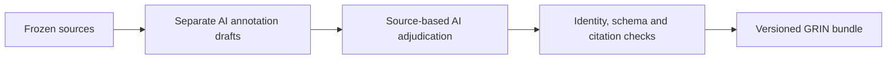
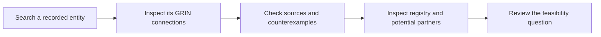
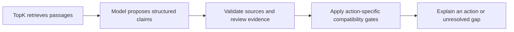

# Atlas — evidence for rare-disease research

Atlas helps a patient organization turn an isolated diagnosis into a sourced research question: **what connects us, what already exists, who could help, and what should we check next?**

Our submission follows one focused case: **selected GRIN2A/GRIN2B variants with published evidence of reduced NMDA-receptor function**. Uncertain and opposing-function variants remain visible so that a plausible connection is never mistaken for proof of shared treatment response.

**[Open the live demo](https://atlas.varentik.com/explore) · [Judge walkthrough and submission record](docs/submission.md) · [Inspect the evidence](https://atlas.varentik.com/cluster)**

**The idea · 1 minute**

https://github.com/user-attachments/assets/bdb998cd-c407-4559-9f88-cc657b84ff92

**How it works · 1 minute**

https://github.com/user-attachments/assets/e552c250-6c12-45aa-a8ff-d0abe264eecd

The **team video was submitted separately**; it does not need to be hosted in this repository. The technical video describes the broader local research workflow. The public demo has the narrower runtime described below.

## Follow one complete journey

1. **Find the starting point.** Search **GRIN2B** in the live graph, select the gene, and choose **Ask about this**. Send the editable question: “What is known about GRIN2B from this knowledge graph, and where can I seek help?” The curated answer separates graph knowledge, evidence limitations, and external support resources.
2. **Inspect the connection.** Search **NMDA receptor signaling** and inspect its connections to selected GRIN2A and GRIN2B variants. Shared receptor-function evidence motivates a research question; it does not establish equivalent clinical outcomes.
3. **Check the counterexample.** In [the evidence viewer](https://atlas.varentik.com/cluster), compare **GRIN2B p.Ser541Arg** with the same-residue substitution **p.Ser541Gly**. They have different reported functional directions. Inspect the source, assay conditions and wild-type comparator rather than grouping by gene or residue alone.
4. **Find an existing asset and partner.** Search **GRIN Variant Patient Registry** in the graph and inspect the resource and maintainer connections. The sourced proposal identifies the Colorado and Leipzig registry teams as potential contacts; access and selected-variant availability still need confirmation.
5. **Leave with a concrete next step.** Read the [research discussion brief](data/curated/grin_research_proposal.json): could existing registry measures support a functionally stratified GRIN2A/GRIN2B observational comparison? The first action is a feasibility discussion about exact variants, aggregate availability, consent/access and comparable outcomes. No request has been sent or study approved.

Ask Atlas also opens with a ready-to-send evidence comparison:

> Why is GRIN2B p.Ser541Arg core while p.Cys461Phe is provisional? Compare the WT measurements and conflicting evidence.

**Dictate instead of typing:** tap the microphone in Ask Atlas, allow microphone access, speak, and tap again to stop. The transcript replaces the untouched demo suggestion or appends to your own draft. Review it, then send. Audio is processed by Cloudflare-hosted Whisper; Atlas does not save recordings. See the [dictation guide](https://github.com/lukaschudy/LIT-knowledge-graph/blob/3ddcee9763d12f70fb7ff51bf94f0f54f8d3c3f7/docs/hosted-dictation.md).

Search covers the **published graph**, including entities outside GRIN. Ask Atlas keeps its detailed answers inside the GRIN demo. Outside that scope, it may acknowledge an entity recorded in the graph and explain the evidence gap; presence alone does not imply a researched disease overview. Missing items can be [proposed for review](https://atlas.varentik.com/propose).

## Which version am I reviewing?

**The canonical demo for this documentation is the Cloudflare release recorded on 4 October 2026:** application commit `0714348`, packaged release record `3ddcee9`, Worker version `d1c8d500-40cf-49c6-985a-c26ee10d4106`. See the [release receipt](https://github.com/lukaschudy/LIT-knowledge-graph/blob/3ddcee9763d12f70fb7ff51bf94f0f54f8d3c3f7/deploy/cloudflare/dense-release.json) and [exact source tree](https://github.com/lukaschudy/LIT-knowledge-graph/tree/3ddcee9763d12f70fb7ff51bf94f0f54f8d3c3f7).

The default branch carries this submission guide and video links. The deployed application source is on `feat/atlas-production-performance`; the broader local model workflow is on `feat/research-recommendations`. The walkthrough and rebuild instructions below pin the deployed version so readers do not have to combine branches.

| Capability | Public demo | Separate local research implementation |
| --- | --- | --- |
| Graph search | Published HGNC/GRIN snapshot, stable identities and source records | Larger harvested and resolved indexes, when prepared locally |
| Ask Atlas | Deterministic GRIN annotation lookup, cited comparisons and curated GRIN2B help | TopK retrieval and model-assisted answers through Codex or the OpenAI API |
| Research actions | Existing sourced registry/partner connections and a committed discussion brief | Evidence extraction, review, action-specific gates, bounded investigation and saved briefs |
| Feedback | Private pending-proposal inbox with durable receipts | Versioned workspace review and reassessment |
| Voice | Microphone capture → Cloudflare-hosted Whisper → editable draft | Separate local faster-whisper implementation |

The local implementation is real but **is not the backend of the hosted chat**. Its setup and limits are linked in the [submission record](docs/submission.md#local-research-implementation). Autonomous evidence watching, public approval-to-graph publishing, held-out scientific evaluation and demonstrated 10× impact remain future work.

## What the numbers mean

| Layer | Recorded scope | Interpretation |
| --- | --- | --- |
| Public graph | **10,033 unique nodes** | 10,000 HGNC projection nodes plus 35 curated GRIN nodes, with two exact gene-identity duplicates merged |
| Curated graph | **35 entities, 44 claims, 56 evidence records** | The compact GRIN research path inside the larger display |
| Seven-paper annotation bundle | **10 selected variants, 340 observations, 53 annotation claims, 11 unresolved issues** | A richer source-annotation representation, not 53 additional graph edges |
| TopK pilot | **15,502 documents**, including passages from **355 licensed full-text articles** | A separate search index; not used by hosted Ask Atlas |
| Source archive | **21,746,825 normalized records across 40 collections** | Recorded local harvest scope; neither the deployed graph nor a count of validated findings |

The HGNC projection carries **5,346 source relationships**; these are not all biological connections or expert-reviewed findings. Node positions form a visual globe and do not encode biological similarity. Read the [coverage report](docs/harvest-coverage.md) and [public data receipt](https://github.com/lukaschudy/LIT-knowledge-graph/blob/3ddcee9763d12f70fb7ff51bf94f0f54f8d3c3f7/data/curated/cloudflare_public_data_receipt.json) before comparing counts.

## Why this architecture

### Preserve evidence before explaining it



The public microphone uses OpenAI Whisper hosted by Cloudflare. OpenAI Codex tools supported the source annotation and reconciliation workflow. Two fresh-context AI annotators used identical source packets; a third audited agreements and disagreements against the sources. The [annotation method](docs/grin-ai-annotation.md) and [receipt](data/benchmarks/grin-v1/cluster-annotation-receipt-v2.json) retain the scope and limitations. Exact underlying model identifiers were not exposed for those annotation runs and are not asserted here. **AI source auditing is not human expert review.**

Measurements, author classifications and proposed research actions remain separate. A low value in one assay cannot silently become an overall loss-of-function conclusion.

### Reveal a useful path in the public demo



The graph preserves sources and review states. The evidence viewer exposes experimental context, uncertainty and conflicting observations. This makes the connection inspectable before a patient organization approaches a research team.

### Keep the local AI loop accountable



This third diagram describes the **separate local implementation**, not a live Cloudflare request. Similarity finds candidates; evidence and explicit gates determine whether a proposed action is supported. The model cannot approve its own evidence. See the [implementation guide](https://github.com/lukaschudy/LIT-knowledge-graph/blob/31a20e279de520a509fcdc05fb5024de07acaa98/docs/architecture/decision-engine.md).

## The 10× case

Our target is **an expert-reviewable research feasibility brief**, an intermediate step toward deciding whether to pursue a shared observational study. The illustrative budget is **20 person-hours manually versus 2 with Atlas**, assuming an already-curated slice and the same review standard. Initial curation, permission delays and downstream research remain separate costs.

**This is an unmeasured target, not an achieved speedup.** The [assumptions and validation plan](docs/submission.md#impact-case-and-validation) explain how to test it. Any stronger wording in presentation materials should be read with this qualification; no 10× research or treatment-development result has been established.

## Reproduce the documented public version

Use a new directory, Python 3.11+ for packaging, and Git. The committed public snapshots are sufficient to build the demo; the full private harvest is not required.

```bash
git clone --branch feat/atlas-production-performance https://github.com/lukaschudy/LIT-knowledge-graph.git atlas-submission
cd atlas-submission
git checkout --detach 3ddcee9763d12f70fb7ff51bf94f0f54f8d3c3f7
python3 scripts/build_cloudflare.py
python3 scripts/verify_cloudflare_build.py
python3 -m unittest discover -s tests
```

To run the Worker locally, also install Node.js and `uv`, with Python 3.13+ available for its runtime:

```bash
cd deploy/cloudflare
uv sync --locked
uv run pywrangler dev --port 8788
```

Open [localhost:8788/explore](http://localhost:8788/explore). Local proposal storage is separate from production. The build includes bounded public excerpts and checks their receipts; it does not publish the full source archive or secrets. See [reproduction levels and validation](docs/submission.md#reproduction-and-verification) for source reacquisition, full annotation rebuilds and optional integrations. Deployment is not required to review the submission.

## Documentation map

| Document | Purpose |
| --- | --- |
| [Submission record](docs/submission.md) | Requirements, pinned versions, complete journey, 10× assumptions, verification and remaining work |
| [GRIN cluster evidence](docs/grin-cluster-evidence.md) | Inclusion rules, seven-paper annotations, counterexamples and scientific limits |
| [Research discussion brief](data/curated/grin_research_proposal.json) | Existing assets, potential partners, feasibility milestone and unresolved questions |
| [Source extraction guide](docs/source-extraction-guide.md) / [harvest coverage](docs/harvest-coverage.md) | Acquisition methods, source permissions, manifests and completeness boundaries |
| [TopK pilot](docs/topk-search.md) | Indexed scope, retrieval regression and optional search setup |
| [Benchmark protocol](docs/grin-benchmark.md) | Scoring machinery and held-out evaluation still needed |
| [Proposal inbox](docs/proposal-inbox.md) | Pending contributions, storage and review boundary |
| [Core guide](ATLAS.md) | Schema, CLI and explicitly fictional software fixtures |
| [Original challenge brief](data/source/challenge-brief.txt) | Required artifacts and judging criteria |

This is a research prototype. Human disease-area expert review is pending. It does not determine diagnosis, treatment or patient eligibility.
