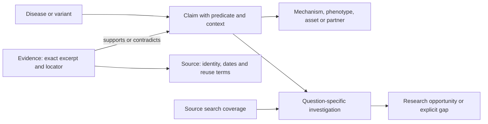

# Atlas: evidence to shared research

**Action assessment update:** the [assay-reuse decision engine](decision-engine.md) adds stricter, task-specific gates and explicit reassessment. This page describes the original evidence graph and legacy disease-neighbour explorer; its `supported_route` status is not the new engine's `ready_for_discussion` status.

This is a runnable knowledge-graph skeleton for the AI Atlas challenge. It demonstrates the data model, provenance, conservative research-lead discovery, source-span validation, interchange formats, and a read-only local explorer. It is not a populated clinical knowledge base, a trained link predictor, or a treatment recommendation system.

## Research translated into design

| Research | Adopted design | Boundary |
|---|---|---|
| [DeepEvidence (2026)](https://www.nature.com/articles/s42256-026-01266-0) | Return an inspectable evidence subgraph for each investigation | Current traversal is deterministic and bounded, not a reproduction of the agent system |
| [Relink (AAAI 2026)](https://arxiv.org/abs/2601.07192) | Preserve missing evidence as a queryable gap; keep proposals separate | Live query-time literature retrieval is a future adapter |
| [AutoBioKG (2026 preprint)](https://www.biorxiv.org/content/10.64898/2026.01.14.699420v1) | Context on claims, including functional effect, tissue, species and stage | No assertion of reproducing its model results |
| [MedKGent (2026)](https://www.nature.com/articles/s41746-026-03058-7) and [ChronoMedKG (2026 preprint)](https://arxiv.org/abs/2605.22734) | Distinct source publication/retrieval dates and biological timing qualifiers | This version stores snapshots; no automatic update/retraction service |
| [Ca2KG (WWW 2026)](https://arxiv.org/abs/2601.09241) | Test evidence deletion, contradictions and unsupported paths | Rule-based decisions and rank are not calibrated clinical probabilities |
| [GraphRAG-Bench (ICLR 2026)](https://arxiv.org/abs/2506.05690) | Keep canonical facts and original evidence available; evaluate by task | No claim that this skeleton outperforms text retrieval |

## Representation

A claim has an independent ID. Multiple evidence records may support or contradict it. Opposite claims are not silently overwritten. Inferences retain their status and cannot serve as observed evidence. Source extraction confidence, where supplied, records an extraction signal only; it is never a clinical probability.

Stable source identifiers belong in node IDs (for example, MONDO, HGNC, ClinVar and HPO IDs). Alias search is a convenience; it does not assert equivalence or merge nodes. Variant identity and genome assembly should be retained in properties before importing real variant records. Gene-level pathogenicity is not a functional mechanism.

The JSON bundle contains `dataset`, `nodes`, `sources`, `claims`, `evidence`, and `coverage`. The machine-readable contract is `schemas/atlas.schema.json`; runtime validation checks foreign keys and typed predicates in addition to structural shape. The SQLite representation has normalized records with foreign keys and a complete-import transaction. Imports replace a dataset only when requested; the CLI requires `--replace` when a database already exists.

## Research lead policy

A mechanistic route uses either a directly reported `Disease → INVOLVES → Mechanism` assertion, or `Disease → HAS_VARIANT → Variant → HAS_EFFECT → Mechanism`. Gene membership helps explain a variant but cannot establish therapeutic similarity.

Candidates must have supported reported paths backed by machine-checked or human-reviewed evidence. Unreviewed extraction output remains a review candidate and cannot establish an actionable route. Machine-checked is a workflow state, not expert scientific validation. Incompatible gain/loss effects are excluded; unknown effects require review. Context differences and contradictions remain visible. Shared symptoms are explanatory context, not sufficient evidence of mechanism compatibility. Negative phenotype annotations are stored explicitly and excluded from positive-overlap scoring.

Actionable results additionally require an evidenced asset link and a partner/maintainer. Asset relevance is not permission to reuse, trial eligibility, or clinical validation. The output asks which part could be adapted, how populations and endpoints differ, and which question the owner or domain expert should resolve next. Ranking is an ordering heuristic, not a probability.

## Acceptance fixture

Every disease, person, organization, source statement and asset in `data/fixtures/atlas-demo.json` is fictional. The interface and exports retain this fact. No live biomedical search has been performed by the demo.

| Query | Intended behavior |
|---|---|
| Aurora / AS-demo | Resolve an alias, inspect a supported route to Boreal and its registry-design asset |
| Aurora vs Cinder | Explain why the same gene with opposing effects does not establish compatibility |
| Aurora vs Echo | Show unknown functional effect as a review requirement |
| Aurora vs Fjord | Expose conflicting evidence instead of quietly accepting a shared mechanism |
| Delta | Explain the unsupported hypothesis, coverage limits, and missing searches |

## Ingestion and AI boundary

`atlas.ingest.hpoa_to_bundle` converts a local HPOA TSV. It retains NOT qualifiers, onset, frequency, original record text and references. It does not infer mechanisms or normalize disease identity beyond the supplied identifier. A row supports its qualified assertion: a NOT row is evidence for absence, not contradictory evidence against an unrelated positive claim. HPO term labels require a separate ontology import.

`atlas.extraction.ground_proposals` accepts proposed AI extractions only when the excerpt exactly matches supplied character offsets, identifiers exist, and the normalized bundle passes validation. Its evidence locator includes a SHA-256 digest of the source snapshot. Input bundles are not mutated, and duplicate proposals are idempotent. This proves text grounding and schema validity; it does not prove entailment, source authenticity, or scientific truth. Extraction outputs remain unreviewed and cannot establish supported action routes until their evidence is explicitly reviewed. Synthetic fixture evidence is machine-checked for software acceptance testing only; this is not biomedical verification.

`prompts/claim-extraction.txt` is a model-independent extraction prompt. No model is currently called. An OpenAI integration can submit the registered entity and predicate catalog, run this boundary, and route accepted proposals to review. The challenge's OpenAI prize requirement is not satisfied merely by shipping this prompt.

## Next implementation increments

1. Select a disease cluster with a real organization, research asset, and inspectable mechanism evidence; adjudicate positive and misleading neighbors with a domain expert.
2. Add pinned MONDO/HPO ontology mapping and a verified source adapter (existing research notes are under `docs/research/`). Keep all accession versions, qualifiers and source terms.
3. Add literature snapshots and OpenAI extraction behind the grounding boundary; evaluate assertion entailment and entity resolution separately.
4. Add ClinicalTrials.gov, organization/asset, investigator and NIH project records; verify owner/contact details from the relevant source.
5. Compare text retrieval, graph-assisted retrieval and context-aware graph retrieval using the same corpus and model. Measure citation support, invalid transfers, useful assets, honest abstention, latency and cost.
6. Add explicit evidence-status and retraction lifecycle, incremental merge semantics, expert review workflow and independent source lineage. Current citations from separate aggregators are not assumed to be independent evidence.

## Deliberate limits

No calibrated confidence, automatic scientific discovery claim, live source freshness guarantee, production authentication, or personal patient data. The local HTTP server is read-only and binds to loopback by default. It is intended for a hackathon demonstration, not public production deployment. Coverage records describe the actual supplied search/import scope; absence of a record is never evidence that a relationship does not exist.
