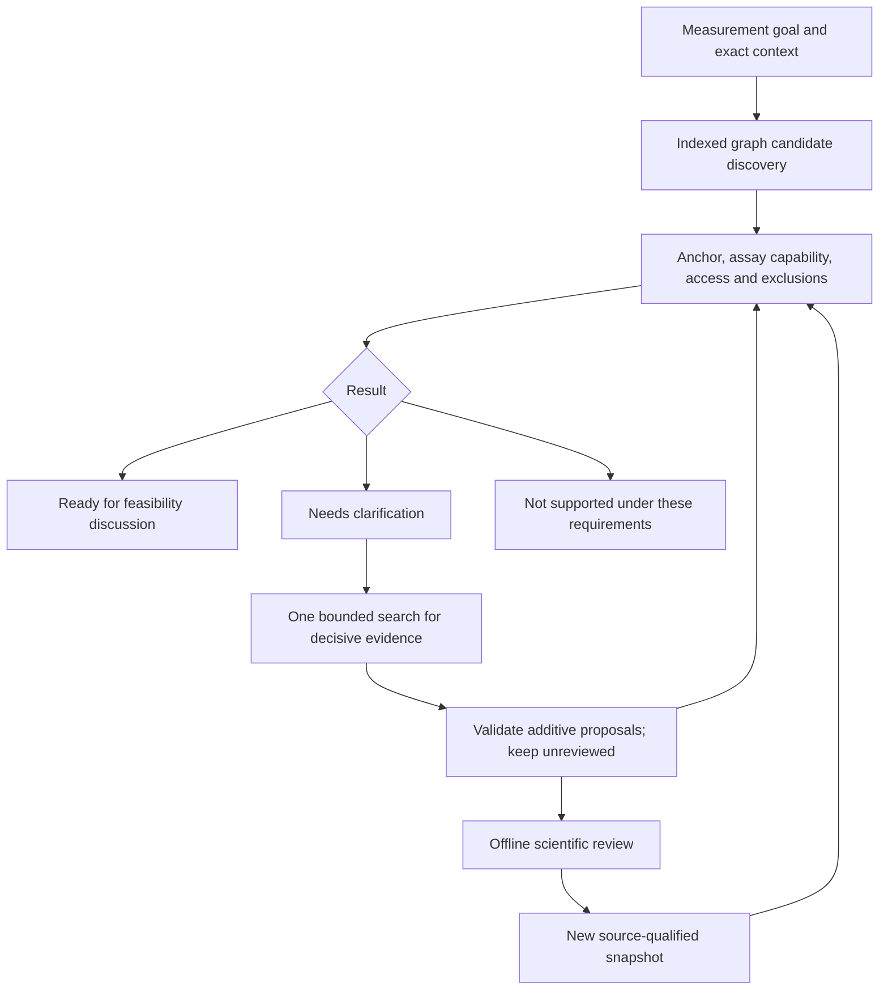

# Action-specific recommendation engine

Implemented 4 October 2026 in [`atlas/recommendations.py`](../../atlas/recommendations.py). The first action is **assess an assay for reuse**. This is a deterministic evidence assessment core with a bounded retrieval interface, a local demo, CLI and read-only HTTP endpoint. Live TopK/model connectors and the frontend recommendation panel are not implemented here.

## Critical review: what changed and why

| Problem in the original design / explorer | Implemented correction |
| --- | --- |
| A shared mechanism plus matching loss of function could produce a supported route. That is too broad for a multi-step pathway. | Assess a concrete measurement request: biological step, readout, species, tissue and optionally developmental/model stage. `RELEVANT_TO` discovers candidates; new `MEASURES` claims justify capabilities. |
| Opposite functional effects were always disqualifying. | For an assay-method question, assess measurement capability. A donor disease's effect direction does not by itself establish or exclude method reuse. This rule must not be reused for treatment recommendations. |
| Several partially compatible claims could appear collectively persuasive. | Every qualifying assay route must describe one coherent context. Never combine the human species from one protocol with the right tissue from another. Preserve alternative routes in the output. |
| Structural checks and scientific review were conflated. | Eligibility requires reported claims with human-reviewed evidence tied to the current source version. An exact quote, machine check, model agreement or model confidence is insufficient. |
| Any contradicting passage meant rejection; separate negated claims could be overlooked. | Distinguish disputed evidence from a documented mismatch. Check equivalent propositions and overlapping broader/narrower opposition. Pending counterevidence can downgrade a candidate but cannot prove it false. |
| Ownership was required, but absent ownership silently removed candidates; access could remain untested. | Show missing owner/access as explicit gaps. Require a source-backed professional contact route and documented open/on-request access. Conflicting available/unavailable reports require reconciliation. |
| Contraindications lacked a research-action scope. | An assay-reuse exclusion can block this action. A therapy exclusion does not automatically exclude a measurement method; unspecified action scope requires clarification. |
| Broad “investigate more” loops could be slow and overconfident. | Search only unresolved gates for candidates without a hard mismatch, seek both support and opposition, allow at most one follow-up call, cap questions/records, and retain the original assessment if retrieval fails. |
| Positive dependency tracking would miss newly added opposition. | Hash the entire evidence snapshot and policy; explicitly reassess on change. This is intentionally conservative invalidation, not yet a fine-grained cache or watcher. |
| Accepting a recommendation could be mistaken for validation. | Preferences are only a late ordering criterion. Recommendation records remain inferred actions, separate from the scientific graph. |

The legacy `/api/explore` and `AtlasReasoner` retain their existing disease-neighbour behavior for compatibility. **Use `/api/recommend` or `atlas recommend` for the new action assessment.** A legacy `supported_route` is not equivalent to a new `ready_for_discussion` result.

## Scope selected for the real demo

The agreed research neighborhood is **EPG5 / Vici syndrome**, with **WDR45 / BPAN** and **AP4B1 / SPG47** as candidate comparators after extraction and coverage review. This is a project scope choice, not an assertion of equivalent defects or transferable treatments. Keep their biological steps and model contexts distinct.

The first deliverable is one reviewable answer to: “Which existing methods could help measure the EPG5 defect, and what would need adaptation or validation?” A suitable assay, an evidenced maintainer/contact, limitations and a proposed feasibility discussion are the minimum useful outcome. Missing data must be surfaced rather than filled with invented biology.

The bundled acceptance dataset uses **entirely fictional diseases, protocols and simulated review states**. It does not claim that evidence for the new real scope has been extracted or reviewed. The older curated GRIN demo remains a separate dataset.

## Decision flow



1. Validate the request and resolve exact disease/mechanism identifiers. No fuzzy entity substitution.
2. Discover assets that measure the requested mechanism or are relevant to diseases in its graph neighborhood. These links generate candidates, not proof of fit.
3. Check source-qualified evidence for the anchor disease's biological step, a coherent assay capability, a maintainer/access route, and applicable exclusions. A disease-level request cannot silently generalize a variant-scoped anchor.
4. Apply gates before ordering. A reviewed context mismatch or explicit applicable exclusion yields `not_supported`; unresolved evidence/access yields `needs_clarification`; all gates passing yields `ready_for_discussion`.
5. Order by status, unresolved-gate count, then user preference, with a stable ID tie-break. This is ordinal triage, not calibrated confidence or a measured utility score. Duplicate citations do not increase rank.
6. Return a proposed next action, partner/contact, supporting and opposing citations, alternative protocol/access routes, dependencies, source-snapshot fingerprint and coverage limitations.

**Ready for discussion is deliberately limited:** existing evidence justifies asking the maintainer to assess feasibility. It does not establish target-disease transfer, availability approval, experimental approval or therapeutic benefit. The first discussion must address protocol controls, adaptation and target-disease validation.

## Evidence contract

The existing bundle schema remains version `1.0` with additive optional fields:

- `MEASURES`: `Asset → Mechanism`. Its source-qualified `context` records `mechanism_step`, `readout`, `species`, `tissue` and `stage` when relevant. Merely sharing a broad mechanism is insufficient.
- `INVOLVES`: `Disease → Mechanism`, with the anchor `mechanism_step`. Known species/tissue/stage restrictions must fit the request; a variant-scoped anchor requires clarification in this disease-level implementation.
- `MAINTAINS`: `Organization → Asset`, with source-backed `access_status` (`open`, `on_request`, `unavailable`) and `contact_url`. An organization's existence or a person mentioning the disease is not proof of asset access or affiliation.
- `CONTRAINDICATED_FOR`: `Asset → Disease`, with `context.action_type: "assay_reuse"` for a definitive action-specific exclusion. Optional measurement/model qualifiers restrict its scope.
- `sources[].version`: an immutable source snapshot identifier, preferably its content hash. `status` is `active` (default), `superseded` or `retracted`.
- `evidence[].source_version`: the exact source version covered by its review. `human_reviewed` without a matching nonempty version is not sufficient for the new engine.

All these qualifiers belong to the evidenced claim. Asset metadata or an LLM-generated rationale cannot substitute for them. Source versions must change when source content changes. Scientific reviewers and the offline ingestion path are trusted; this code does not authenticate reviewers or establish that an excerpt entails a claim. That requires a separate review workflow.

Qualifiers use exact normalized identifiers. Ontology equivalence, broad/narrow tissue matching, uncontrolled synonyms and stage translation are not inferred. Missing required information yields clarification. If an assay specifies a stage and the request does not, it cannot silently become eligible. Both omitting stage means no stage restriction is recorded, not proof of stage independence.

## Run the four-case demo

From the repository root:

```bash
python3 -m atlas ingest data/fixtures/recommendation-demo.json --db /tmp/atlas-recommendation-demo.sqlite
python3 -m atlas recommend data/fixtures/recommendation-request.json \
  --db /tmp/atlas-recommendation-demo.sqlite --output /tmp/atlas-recommendations.json
```

Use a fresh database path, or `ingest --replace` only to replace your own prior demo database.

| Fictional candidate | Expected assessment | Reason |
| --- | --- | --- |
| Fusion assay | Ready for discussion | Documented requested measurement context and an on-request access/contact route. |
| Assay with missing context | Needs clarification | Tissue is missing from the protocol evidence. |
| Early-stage assay | Not supported | Shared broad pathway and functional-effect label do not compensate for the wrong biological step. |
| Assay with an exclusion | Not supported | An applicable, reviewed assay-reuse exclusion blocks it. |

Exercise the retrieval boundary with an offline response:

```bash
python3 -m atlas recommend data/fixtures/recommendation-request.json \
  --db /tmp/atlas-recommendation-demo.sqlite \
  --followup-proposals data/fixtures/recommendation-proposals.json \
  --output /tmp/atlas-followup.json
```

The response supplies the missing tissue, but the engine resets its supplied review label to `unreviewed`. The candidate remains in clarification until offline review. Proposed records are returned as `evidence_proposals`; they are **not written into the database**. The tests demonstrate that ingesting a scientifically reviewed updated snapshot can then promote the candidate.

To compare a saved result against the current database snapshot:

```bash
python3 -m atlas reassess /tmp/atlas-recommendations.json \
  --db /tmp/atlas-recommendation-demo.sqlite
```

This returns new assessments and a change list; it does not mutate the saved result. `RecommendationEngine.is_current(result)` detects evidence/policy changes, including newly added counterevidence. A removed or truncated candidate is labeled `not_in_current_candidate_set`, not asserted scientifically false.

For frontend integration:

```bash
python3 -m atlas serve --db /tmp/atlas-recommendation-demo.sqlite
```

`GET /api/recommend` takes `disease_id`, `mechanism_id`, `mechanism_step`, `readout`, `species`, `tissue` and optional `stage` as URL-encoded query parameters. It is read-only, uses the server's startup snapshot, and does not perform paid network/model calls. Restart the server after ingestion to serve a new snapshot. Existing browser screens are not yet wired to this endpoint.

## Bounded follow-up and speed

`EvidenceRetriever.retrieve(questions, max_claims=...)` is the adapter boundary for future TopK retrieval plus grounded extraction. It returns an additive delta of nodes, sources, claims and evidence. Existing identifiers cannot be replaced, references must validate, quotas are enforced, and every returned evidence row is reset to unreviewed. Source revisions/retractions must use the offline update path; accepting arbitrary live source replacements would let a connector silently change prior evidence.

Defaults: 40 candidates per assessment (maximum 100), at most 3 follow-up questions (maximum 5), one follow-up call/round, and 30 new claims (maximum 100), with corresponding node/source/evidence limits. The response discloses candidates omitted by the cap. Shortlisting is deterministic, not a guarantee that the best possible asset was included.

Indexing and snapshot hashing happen when the engine is created, outside the HTTP request path. Assessment uses indexed adjacency and caches claim evidence states within the immutable snapshot. Returned records retain citations; evidence payload size is not a separate hard cap in v1.

These are **work quotas, not a wall-clock guarantee**. A future network adapter must enforce its own timeouts, cancellation and monetary limits. A synchronous callback that hangs cannot be interrupted by this engine. No production latency or 10× improvement is claimed.

## Tests and remaining work

`python3 -m unittest discover -s tests -v` includes adverse cases for context mismatch, missing evidence, separate/broad negation, conflicting access, unreviewed counterevidence, duplicate citations, preference isolation, source revision/retraction, newly added exclusions, over-budget or failing retrieval, and CLI/HTTP execution.

This is a development acceptance suite, not held-out biomedical evaluation. Next integration work:

1. Finish source extraction and coverage assessment for the selected real scope; normalize identifiers and curate the measurement/access evidence with qualified review.
2. Implement live TopK passage retrieval and grounded model extraction behind the adapter. Retrieval relevance and model judgments must remain separate from scientific eligibility.
3. Add the recommendation/evidence panel and a review queue. Add authenticated review records before a multi-user production workflow.
4. Benchmark against search, RAG and graph-assisted retrieval on held-out tasks with qualified reviewers. Measure acceptable proposals, unsupported assertions, abstentions, correction person-hours, total cost and latency. Demonstrate an advantage rather than assuming one.
5. Extend action types to model reuse and collaborator discovery with their own gates. Add selective invalidation/background maintenance only after evidence dependencies and new-negative detection are measured.
