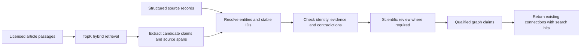

# TopK search and the evidence graph

TopK is the retrieval layer. Source records remain the canonical evidence archive, and the graph retains qualified entities and relationships. Search ranking does not establish a biological relationship.

The first index contains **15,502 documents**: **56 curated evidence cards**, **15,132 article passages**, and **314 table-text passages**, drawn from the selected GRIN evidence bundle and **355 harvested licensed full texts**. This is a focused pilot, not an upload of the complete 21,746,825-record harvest. Search records are different from source records and from unique scientific facts.

## How relationships become graph connections



For example, `GRIN2B S541R → HAS_EFFECT → reduced NMDA-receptor function` needs the source paper, specific table or passage, assay/model conditions, variant identity and review status. It is not inferred merely because two nodes have similar text. One variant can have different effects on different measured parameters, and conflicting studies must remain separate evidence records.

There are two acquisition paths:

1. ClinVar, HPO, Reactome and other structured sources supply explicit identifiers and provider-reported associations. Map these directly with their source provenance and qualifiers; do not send every annotation through a language model or embed every join row.
2. Literature supplies additional candidate relationships. Retrieve relevant passages, extract structured claims with source spans, resolve entities, and validate the claims before admitting them to the graph. This broader claim-extraction layer is **not implemented by this TopK integration**.

The implemented integration returns **existing curated graph claims** through exact `evidence_id` and `claim_id` links. A bundle SHA-256 check prevents sequential IDs from accidentally resolving against a different graph revision. Uncurated full-text hits cannot create graph edges. No new treatment recommendation or clinical cohort eligibility is established by a search result.

## Retrieval behavior

- **Semantic retrieval:** TopK's managed `semantic_index()` on passage content.
- **Keyword retrieval:** BM25 over indexed text, including explicit short protein aliases on curated cards.
- **Hybrid retrieval:** independent top-50 candidate lists combined with reciprocal rank fusion, `1 / (60 + rank)`. This avoids directly adding BM25 and semantic scores with unrelated scales.
- **Identity constraints:** an unambiguous gene and protein substitution in a query become exact metadata filters. `GRIN2B S541R` and `GRIN2B p.Ser541Arg` resolve to the same protein token; `S541G` remains separate. A protein filter without a gene is rejected. This resolves protein notation only, not transcript-specific DNA alleles.
- **Source scope:** curated evidence, full-text discovery, table text, or all passages. Full-text gene/protein tags are text mentions and can refer to multiple entities in a passage; co-occurrence does not resolve an allele.
- **Review and effect:** unknown, provisional, opposing and reduced-function findings remain available. Only effect claims inherit a functional classification; unrelated clinical or identity evidence is not relabeled as functional proof.

JATS extraction retains paragraph/section/table locators. Passages are at most 3,600 normalized source characters, with a 400-character overlap for longer units. Tables are searchable text with their source locator, explicitly marked as **uninterpreted layout**; image-only content is not invented. HTML fallback records are uncurated body text and may contain page/reference material.

Each document includes source ID, URL, locator, rights, normalized content, snapshot ID and review status. Curated cards additionally include graph entity IDs, claim/evidence IDs, stance and claim context. Content and metadata determine the document ID. The snapshot is derived from the input checksums and exporter version.

## Local setup

Use Python 3.11 or later and install the optional dependency:

```bash
python3 -m venv .venv
.venv/bin/pip install -e '.[search]'
```

The repository ignores `.env`. Store the API key locally; never put it in browser code, a command argument, a commit or an exported report.

```dotenv
TOPK_API_KEY=<your local key>
TOPK_REGION=aws-us-east-1-elastica
TOPK_COLLECTION=lit-grin-evidence-v1
```

If the region is blank, the adapter uses TopK's documented `aws-us-east-1-elastica` default. The region is an SDK setting, not part of the API key. A local secret-file reader accepts literal assignments to these recognized settings and never executes shell commands. Environment variables take precedence.

```bash
.venv/bin/python -m atlas.search --env-file .env status
python3 -m atlas.search prepare
.venv/bin/python -m atlas.search --env-file .env ingest \
  --export data/processed/search/grin-passages.jsonl.gz \
  --checkpoint data/processed/search/topk-ingest.json --create
.venv/bin/python -m atlas.search.evaluate --env-file .env \
  --checkpoint data/processed/search/topk-ingest.json
.venv/bin/python -m atlas.search.server --env-file .env \
  --checkpoint data/processed/search/topk-ingest.json --port 18767
```

The local inspection page is at `http://127.0.0.1:18767`. It makes requests to the Python backend; credentials remain in the backend process. The standalone page is separate from the main Atlas frontend under active development.

For CLI search, copy the exact `snapshot_id` from the export manifest:

```bash
.venv/bin/python -m atlas.search --env-file .env query \
  'GRIN2B S541R reduced NMDA receptor function' \
  --snapshot <snapshot_id> --kind curated_evidence \
  --checkpoint data/processed/search/topk-ingest.json
```

`--checkpoint` enables graph linking after verifying the graph revision. Without it the CLI returns search hits only. `--mode keyword`, `--mode semantic` and `--mode hybrid` allow direct comparison.

## Upload and verification

Uploads use deterministic IDs, at most 100 documents / 1 MB per batch, no document larger than 64 KB, and one write worker by default. `--workers` allows up to four concurrent writes when account capacity permits. The process paces API calls to two per second and retries transient request-limit errors with bounded backoff. Account-wide quotas also cover other clients, so these limits are not a guarantee that requests cannot be throttled.

Checkpoints advance only through contiguous acknowledged batches. An interrupted write is safely replayed using the same IDs. After all writes complete, one identical document is rewritten to establish a final read-consistency barrier; LSN strings are never compared as if their ordering were known. Every exported ID and every stored field is then read back and compared with the local export before the index is marked verified.

Searches always filter by the active snapshot. An older snapshot can remain stored without leaking into new results. This implementation does **not** automatically delete old snapshots, so switching snapshots can temporarily increase storage. Choose a new checkpoint for a changed export; the adapter refuses to reuse a checkpoint for another target or content digest.

Raw and normalized datasets, secrets, upload progress and the passage export stay outside Git. Code, compact input/export manifests and evaluation summaries are versioned. TopK is a derived searchable copy, not the only copy of the evidence.

## Quality measurement and the next scale step

The included development regression uses the ten already curated variants: six reduced-function leads, two opposing controls, one provisional variant and one unresolved variant. It compares keyword, semantic and hybrid retrieval for a relevant classified card in the top five, exact-variant constraints, citations and latency. It also checks that raw full-text discovery creates no graph claims.

This is a known-case regression, **not a held-out biomedical retrieval benchmark**. High scores on it do not demonstrate that hybrid search beats keyword search, that the system has found all relevant variants, or that clustering is scientifically valid. Broader quality evaluation needs independently judged questions and relevance sets, including difficult negatives and contradictory evidence.

The next scale step is to prepare the 2,122,515 distinct article metadata records and their available abstracts, with source-aware rights handling and PMID/PMCID/DOI deduplication. Structured gene/disease/variant identifiers belong in a separate entity lookup/index; relationship and query-membership rows should not become generic semantic documents. Before a multi-million-document upload, measure passage counts, actual TopK usage/cost and a held-out quality sample. The full harvest has not yet been indexed in TopK.

Official technical references, checked 2026-10-04: [semantic retrieval](https://docs.topk.io/guides/semantic-search), [keyword retrieval](https://docs.topk.io/guides/keyword-search), [write semantics](https://docs.topk.io/collections/write), [SDK reference](https://docs.topk.io/sdk/topk-py), [regions](https://docs.topk.io/regions), [limits](https://docs.topk.io/limits). The write and limits pages currently give different maximum document sizes; this adapter stays below both.
